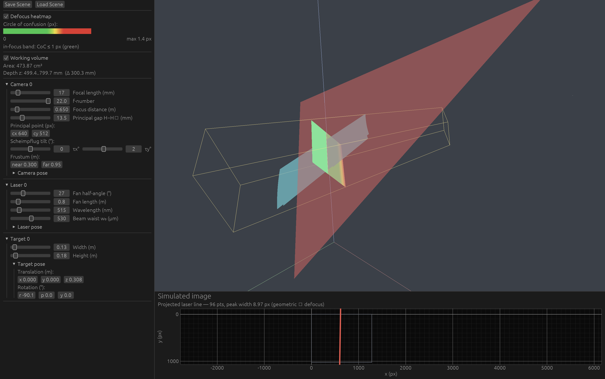

# etendue

[](https://github.com/VitalyVorobyev/etendue/actions/workflows/ci.yml)
[](https://vitalyvorobyev.github.io/etendue)
[](https://github.com/VitalyVorobyev/etendue/actions/workflows/audit.yml)
[](LICENSE)

Interactive design of laser-triangulation 3D-sensor optical systems. Pure Rust, native
desktop (egui + wgpu). Lets a mechanical/optical designer pick focal length, f-number,
focus distance, Scheimpflug tilt, laser geometry, and see — live — where the working
volume lands, how the laser line projects, and where focus falls off.

## Status

M0–M10 plus post-MVP features complete. **205** tests pass. Scheimpflug
circle-of-confusion physics derived from first principles and validated against hand
calculations (M4 kill gate passed): on-PoBF cancellation exact to machine epsilon
(~1e-18); off-axis regime (b) c = 51.6529 µm = 14.97185 px matches the textbook
formula independently. M9 Scheimpflug solver convergence validated against the analytic
fronto-parallel optimum; M10 N-view voxel overlap and symmetric ring geometry verified.
Gaussian PSF and triangle-mesh laser intersection shipped in the post-MVP pass.

## Screenshot



Default MVP scene: the 3D viewport shows the camera frustum, laser fan, and target quad;
the parameter panel (left) exposes focal-length, f-number, Scheimpflug tilt, and pose sliders;
the defocus heatmap colors the target from sharp green through yellow to blurry red, and the
translucent working-volume patch on the laser fan marks the in-focus, in-view measurement region.

## Quick start

```bash
# etendue depends on calibration-rs via a path dep — both siblings must live
# under the same parent directory.
git clone https://github.com/VitalyVorobyev/calibration-rs
git clone https://github.com/VitalyVorobyev/etendue
cd etendue
cargo run
```

## Architecture

```
etendue-ui (binary)
    │  winit + wgpu + egui + egui-wgpu render loop
    │  viewport, parameter panel, simulated-image panel
    │
    └──depends on──► etendue-core (kernel)
                         │  scene, geometry, thick-lens optics
                         │  Scheimpflug CoC, laser projection,
                         │  working-volume analysis, bank schema
                         │
                         └──path dep──► vision-calibration-core
                                           (from calibration-rs)
```

| Crate | Role |
|---|---|
| `etendue-core` | Geometry and optics kernel (concrete `f64`). `Scene`, `ThickLens`, Scheimpflug CoC, laser projection, working-volume analysis, component-bank schema. |
| `etendue-ui` | The binary. winit + wgpu + egui + egui-wgpu render loop; 3D viewport, parameter panel, simulated-image panel. |

## MVP demo

1. Launch `cargo run`. The default scene opens with a camera–laser–target triangulation
   rig, the defocus heatmap, and the working-volume overlay both on.
2. In the parameter panel, note the **Optimal distance (m)** readout or use the
   Scheimpflug solver section to solve for tilt + focus given a depth window.
3. Drag the **Focus distance** slider until the green in-focus band on the heatmap covers
   your target depth range.
4. Adjust **Focal length** and **f-number** to trade field width against depth of field.
5. Tune **Scheimpflug tilt** (τx) to tilt the plane of best focus to follow the laser
   plane at an oblique angle.
6. Adjust the laser **fan angle** and the **laser pose** until the working-volume area
   (mm²) and depth-range (mm) readouts match what you would write on a sensor spec sheet.
7. Save the scene as JSON with **File → Save scene** for a reproducible record of the
   parameter set.

## Documentation

- Book: https://vitalyvorobyev.github.io/etendue (built by `publish-docs.yml`)
- Scheimpflug derivation: [`docs/derivations/scheimpflug_pobf.md`](docs/derivations/scheimpflug_pobf.md)
- Original design doc: [`docs/handoff.md`](docs/handoff.md)

## Roadmap

The following items remain open (all other post-MVP queue items have shipped):

1. Promote `ThickLens` to a first-class `ApertureModel<S>` trait in calibration-rs
   (upstream PR, requires calibration-rs maintainer review).
2. Component-picker UI — browse `assets/bank/`, drag components onto the scene.

## Reuse from calibration-rs

etendue depends on `vision-calibration-core` from the sibling
[calibration-rs](https://github.com/VitalyVorobyev/calibration-rs) workspace via path
dependency. New optics functionality (the `ThickLens` model) will be upstreamed to
calibration-rs as a first-class `ApertureModel<S>` trait once it stabilizes. The
dependency is never vendored or forked.

## Diligence statement

This project is developed with AI coding assistants (Claude Code) as implementation
tools. The project author is an expert in computer vision and physics, validates all
algorithmic behavior and numerical results, and enforces quality gates
(`fmt`/`clippy`/tests) before release.

## License

MIT — see [LICENSE](LICENSE).
